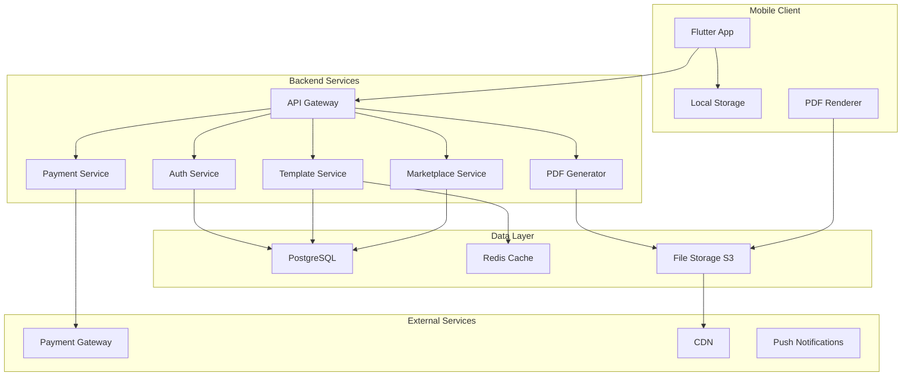

# QuickPDF Template Marketplace Design Document

## Overview

QuickPDF is a mobile-first application that combines PDF generation capabilities with a dynamic template marketplace. The system architecture follows a microservices approach with a Flutter mobile client, Node.js backend services, PostgreSQL database, and integrated payment processing. The core innovation lies in the dynamic template system that converts JSON schema definitions into interactive forms and generates customized PDFs through placeholder injection.

## Architecture

### High-Level Architecture



### Mobile Architecture

The Flutter application follows a clean architecture pattern with clear separation of concerns:

- **Presentation Layer**: UI widgets, state management (Provider/Riverpod)
- **Domain Layer**: Business logic, entities, use cases
- **Data Layer**: Repositories, data sources (local/remote), models

### Backend Microservices

1. **Auth Service**: JWT authentication, user management, role-based access
2. **Template Service**: Template CRUD, validation, versioning, search
3. **PDF Generator Service**: Dynamic form generation, data injection, PDF rendering
4. **Marketplace Service**: Template discovery, ratings, categories, analytics
5. **Payment Service**: Purchase processing, revenue tracking, creator payouts

## Components and Interfaces

### Core Components

#### PDF Generation Engine
- **Input**: Raw text or template with user data
- **Processing**: Text formatting, placeholder injection, styling application
- **Output**: PDF buffer with proper encoding and metadata
- **Performance**: <1 second for simple text, <3 seconds for complex templates

#### Dynamic Template System
- **Schema Definition**: JSON-based template structure with typed placeholders
- **Form Generator**: Automatic UI generation from schema
- **Validation Engine**: Type checking, required field validation, format validation
- **Data Injection**: Safe placeholder replacement with sanitization

#### Marketplace Engine
- **Search & Discovery**: Full-text search, category filtering, popularity ranking
- **Recommendation System**: User behavior analysis, collaborative filtering
- **Quality Control**: Admin review queue, automated validation, user reporting

### API Interfaces

#### Template API
```typescript
interface Template {
  id: string;
  title: string;
  description: string;
  category: string;
  placeholders: Record<string, PlaceholderConfig>;
  body: string;
  price: number;
  createdBy: string;
  rating: number;
  downloadCount: number;
}

interface PlaceholderConfig {
  type: 'string' | 'text' | 'date' | 'number' | 'select' | 'checkbox';
  label: string;
  required: boolean;
  validation?: ValidationRules;
  defaultValue?: any;
  options?: string[]; // for select type
}
```

#### PDF Generation API
```typescript
interface PDFGenerationRequest {
  templateId?: string;
  userData: Record<string, any>;
  rawText?: string;
  styling: PDFStyling;
}

interface PDFStyling {
  fontSize: number;
  fontFamily: string;
  margins: Margins;
  alignment: 'left' | 'center' | 'right' | 'justify';
}
```

## Data Models

### User Model
```typescript
interface User {
  id: string;
  email: string;
  fullName: string;
  role: 'user' | 'creator' | 'admin';
  isVerified: boolean;
  balance: number;
  totalEarnings: number;
  createdAt: Date;
}
```

### Template Model
```typescript
interface Template {
  id: string;
  title: string;
  description: string;
  categoryId: string;
  body: string;
  placeholders: Record<string, PlaceholderConfig>;
  createdBy: string;
  price: number;
  status: 'pending' | 'published' | 'rejected';
  isVerified: boolean;
  isFeatured: boolean;
  rating: number;
  totalRatings: number;
  downloadCount: number;
  purchaseCount: number;
  version: string;
  createdAt: Date;
  updatedAt: Date;
}
```

### Purchase Model
```typescript
interface Purchase {
  id: string;
  userId: string;
  templateId: string;
  amount: number;
  paymentMethod: string;
  transactionId: string;
  status: 'pending' | 'completed' | 'refunded';
  purchasedAt: Date;
}
```

### Document Model
```typescript
interface Document {
  id: string;
  userId: string;
  templateId?: string;
  filename: string;
  content: string; // JSON serialized user data
  fileUrl: string;
  createdAt: Date;
}
```

## Error Handling

### Client-Side Error Handling
- **Network Errors**: Retry mechanism with exponential backoff
- **Validation Errors**: Real-time field validation with user-friendly messages
- **PDF Generation Errors**: Graceful fallback with error reporting
- **Payment Errors**: Clear error messages with retry options

### Server-Side Error Handling
- **Input Validation**: Comprehensive validation with detailed error responses
- **Database Errors**: Transaction rollback and error logging
- **External Service Failures**: Circuit breaker pattern for payment gateways
- **Rate Limiting**: 429 responses with retry-after headers

### Error Response Format
```typescript
interface ErrorResponse {
  error: {
    code: string;
    message: string;
    details?: Record<string, any>;
    timestamp: string;
  };
}
```

## Testing Strategy

### Unit Testing
- **Coverage Target**: Minimum 80% code coverage
- **Focus Areas**: Business logic, data validation, PDF generation algorithms
- **Tools**: Jest (Node.js), Flutter Test (Dart)
- **Mocking**: External services, database operations, file system

### Property-Based Testing
- **Library**: fast-check (Node.js), test_check (Dart)
- **Test Configuration**: Minimum 100 iterations per property test
- **Property Identification**: Each correctness property will be implemented as a single property-based test
- **Test Tagging**: Each property test will include a comment with format: `**Feature: quickpdf-template-marketplace, Property {number}: {property_text}**`

### Integration Testing
- **API Testing**: End-to-end API workflow testing
- **Database Testing**: Repository pattern testing with test database
- **Payment Testing**: Sandbox environment testing with mock transactions
- **PDF Generation Testing**: Template processing and output validation

### End-to-End Testing
- **User Flows**: Complete user journeys from registration to PDF generation
- **Cross-Platform**: iOS and Android device testing
- **Performance Testing**: Load testing with 1000+ concurrent users
- **Security Testing**: Authentication, authorization, and input validation testing

## Correctness Properties

*A property is a characteristic or behavior that should hold true across all valid executions of a system-essentially, a formal statement about what the system should do. Properties serve as the bridge between human-readable specifications and machine-verifiable correctness guarantees.*

### Property Reflection

After analyzing all acceptance criteria, several properties can be consolidated to eliminate redundancy:

- Properties related to PDF generation performance (1.2) and template processing (6.4) can be combined into a comprehensive PDF generation property
- Properties about text formatting (2.1, 2.2, 2.3, 2.4) can be consolidated into a single formatting preservation property
- Properties about template validation (7.1) and placeholder support (7.2) can be combined into template structure validation
- Properties about payment processing (8.1) and access granting (8.2) can be consolidated into purchase workflow property

### Core Properties

**Property 1: PDF Generation Performance**
*For any* valid text input or completed template form, PDF generation should complete within the specified time limits (1 second for text, 3 seconds for templates) and produce a valid PDF document
**Validates: Requirements 1.2, 6.4**

**Property 2: Text Formatting Preservation**
*For any* text with applied formatting (font size, style, alignment, headings), the formatting should be preserved accurately in the generated PDF output
**Validates: Requirements 2.1, 2.2, 2.3, 2.4**

**Property 3: Turkish Character Support**
*For any* text containing Turkish characters (ç, ğ, ı, ö, ş, ü), the characters should be correctly encoded and displayed in the generated PDF
**Validates: Requirements 1.5**

**Property 4: Offline Functionality Preservation**
*For any* PDF generation operation, the system should function correctly regardless of network connectivity status
**Validates: Requirements 3.1, 3.2**

**Property 5: Document History Management**
*For any* sequence of document creation operations, the system should maintain exactly the last 50 documents with complete metadata
**Validates: Requirements 4.1, 4.5**

**Property 6: Template Search Accuracy**
*For any* search query with keywords, categories, or tags, all returned templates should match the search criteria and include required display information
**Validates: Requirements 5.2, 5.3**

**Property 7: Dynamic Form Generation**
*For any* template with defined placeholders, the system should generate a form with fields matching the placeholder types and validation rules
**Validates: Requirements 6.1, 6.2**

**Property 8: Template Data Injection**
*For any* template and valid user input data, the system should correctly replace all placeholders with user data while preserving template formatting
**Validates: Requirements 6.3, 6.5**

**Property 9: Template Structure Validation**
*For any* uploaded template, the system should validate placeholder definitions, field types, and template structure before allowing publication
**Validates: Requirements 7.1, 7.2**

**Property 10: Price Range Validation**
*For any* template pricing input, the system should accept only values between 5 TL and 500 TL or exactly 0 TL for free templates
**Validates: Requirements 7.3**

**Property 11: Creator Earnings Calculation**
*For any* template sale transaction, the creator should receive exactly 80% of the sale price after successful payment processing
**Validates: Requirements 7.5**

**Property 12: Purchase Access Control**
*For any* template purchase transaction, successful payment should immediately grant template access, and only users who have purchased should be able to rate templates
**Validates: Requirements 8.1, 8.2, 8.5**

**Property 13: Rating System Integrity**
*For any* template with ratings, the displayed average and count should accurately reflect all submitted ratings within the 1-5 star range
**Validates: Requirements 8.3, 8.4**

**Property 14: Admin Review Workflow**
*For any* submitted template, it should enter the admin review queue and require explicit approval or rejection with reasons before publication
**Validates: Requirements 9.1, 9.3**

**Property 15: Input Sanitization Security**
*For any* user input containing potentially malicious content, the system should sanitize the input to prevent XSS and injection attacks
**Validates: Requirements 10.4**

**Property 16: Authentication Token Management**
*For any* user authentication session, JWT tokens should have appropriate expiration times and refresh mechanisms should work correctly
**Validates: Requirements 10.3**

**Property 17: Data Encryption Compliance**
*For any* sensitive user data stored in the system, the data should be encrypted using industry-standard encryption methods
**Validates: Requirements 10.2**

**Property 18: Rate Limiting Enforcement**
*For any* sequence of API requests from a single source, the system should enforce rate limits to prevent abuse while allowing normal usage
**Validates: Requirements 10.5**